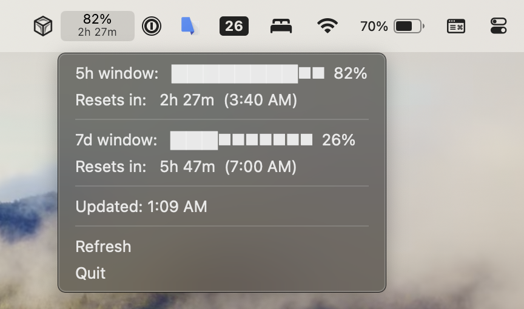

# Claude Usage Menu Bar

A lightweight macOS menu bar app that shows your Claude API rate-limit usage in real time — no API key required.



## What it does

Sits in your menu bar and displays:

- **Current usage** as a percentage of your 5-hour rate-limit window
- **Live countdown** to when the window resets
- A dropdown with the full 5h and 7d window bars and exact reset times

It auto-refreshes every 5 minutes, and the reset countdown ticks down every second.

## How it works

Claude Code stores an OAuth token in your macOS Keychain when you log in. This app reads that token and makes a minimal 1-token API call to `POST /v1/messages`. Anthropic's API returns rate-limit utilization and reset timestamps in the response headers — no admin key or organization account needed.

The app never stores credentials and makes no calls beyond the periodic refresh.

## Requirements

- macOS 12 or later
- [Claude Code](https://claude.ai/download) installed and logged in

## Install from source

```bash
git clone https://github.com/yourusername/claude-usage-in-menu-bar.git
cd claude-usage-in-menu-bar

python3 -m venv venv
venv/bin/pip install -r requirements.txt

venv/bin/python3 app.py
```

The app will appear in your menu bar immediately.

## Build and install

Run the install script to build, install to `/Applications/`, and launch the app:

```bash
./install.sh
```

This builds a standalone `.app` with py2app, copies it to `/Applications/ClaudeUsage.app`, and starts it in the background with logs redirected to `~/Library/Logs/ClaudeUsage.log`.

**First launch:** macOS will block it because it isn't notarized. Right-click → Open to bypass, or run:

```bash
xattr -cr /Applications/ClaudeUsage.app
```

## Logs

```bash
./logs.sh
```

Tails `~/Library/Logs/ClaudeUsage.log` live. Useful for diagnosing token or API errors.

## Auto-start on login

After installing to `/Applications/`, go to **System Settings → General → Login Items** and add Claude Usage.

## Refresh behavior

| Trigger | What happens |
|---|---|
| App launch | Immediate fetch |
| Every 5 minutes | Auto-refresh |
| Click "Refresh" | Immediate fetch |
